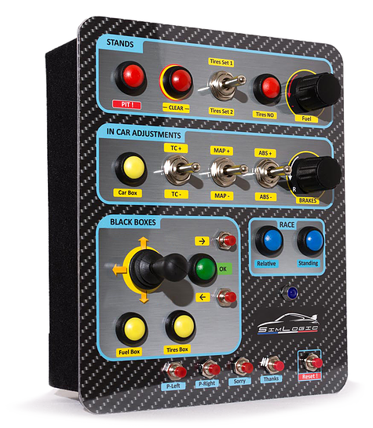

# Simracing

Simracing addons: Buttonboxes and Displays 

The following functions are expected to be mapped on the steering wheel:

* Brake bias settings
* Any  

## [Starterbox](https://github.com/robbyb67/simracing/tree/master/starterbox)

This is a box providing 

* Ignition switch
* Starter button
* Pit limiter switch
* Traction control 1/2 selection switch (for GTE cars)
* Rotary encoder for traction control setting w. push function TC off
* Rotary encoder for ABS setting w. push function ABS Toggle (for GT cars)
* Rotary encoder for fuel mix/throttle shaping w. push function to switch between functions
* LED to indicate selected engine setting (fuel mix or throttle shaping)

## Future projects

### [iRacing race control button box](https://github.com/robbyb67/simracing/tree/master/rccbox)

Inspired by the [Simlogic box](https://www.simlogic-shop.com/home)

#### Planned Features:

##### Stands section

* Announce pitstop button
* Clear tires button
* Switch to select between read / oval
* 2 way rocker switch to select left (rear) / right (front) tires depending on road/oval selection
* Rotary encoder to select fuel refill w. push function to clear fuel

##### Race section

* Button to select absolute position black box
* Button to select relative position black box
* Button to select lap timing black box

##### Radio section

* Rotary encoder for voice chat volume w. push function to mute voice chat
* Mute driver button
* Rotary encoder for radio channel select w. push to display radio black box

##### Black box (UI) section

* Rotary encoder to select black box value
* Rotary encoder to increase/decrease selected black box value w. push function for value toggle
* Button to select fuel black box
* Button to select tire black box
* Button to select in car black box
* add. black box selection buttons
* 2 way switch to shift driving view up/down

### SLIManager Teensy lights panel

Some LED work: [V2R controller](http://www.eksimracing.com/help/getting-started-with-eksimracing-vtor-controller/)

