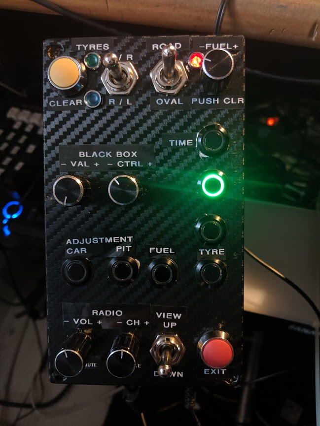
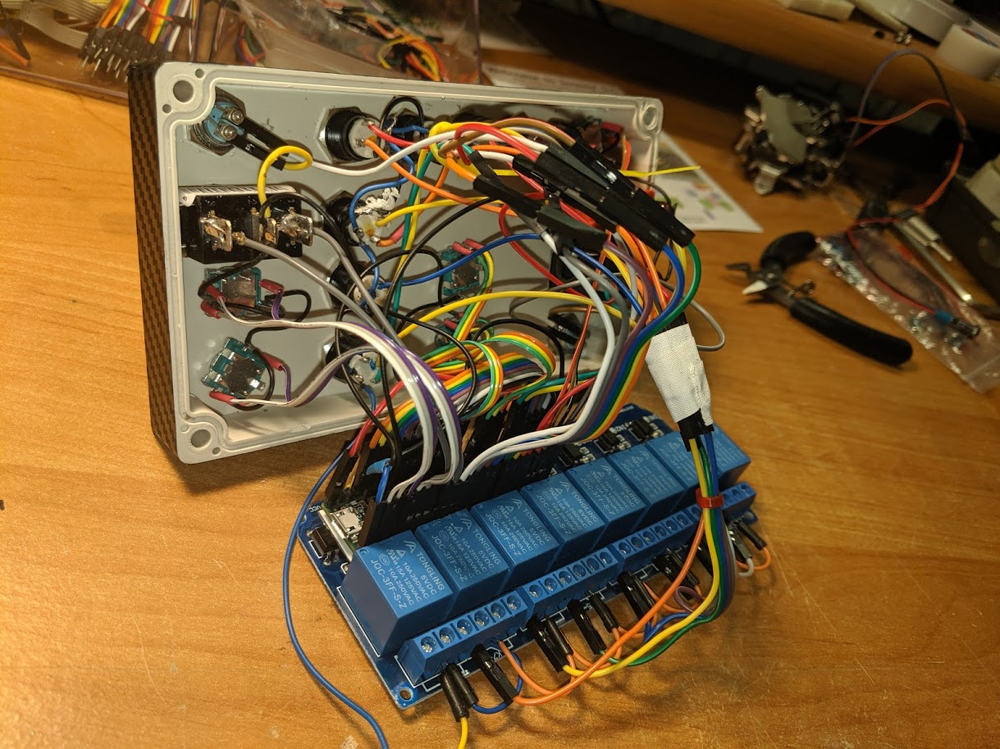
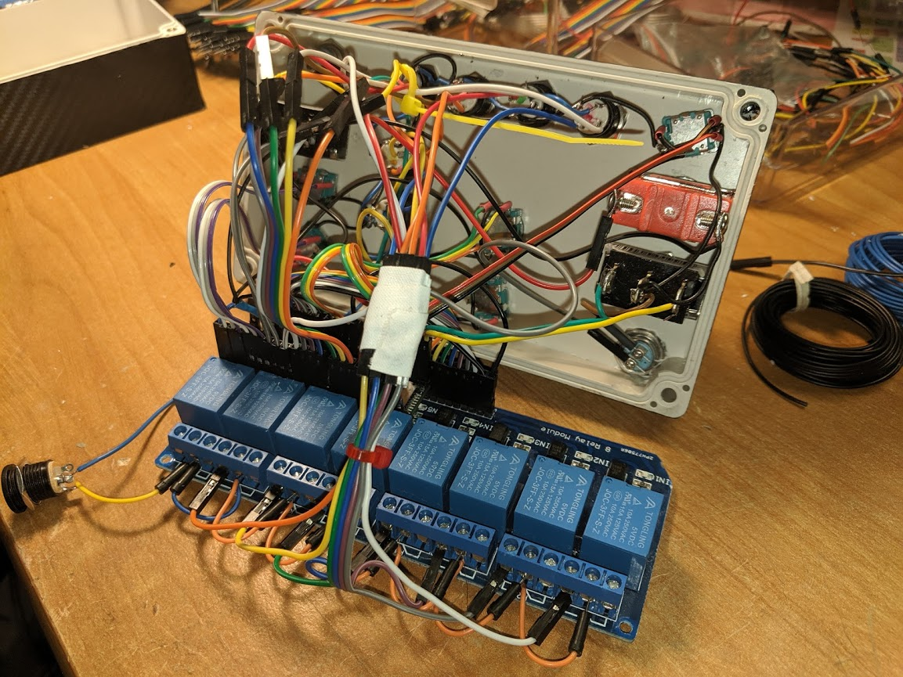

# Buttonbox for race control features

The box utilizes a Teensy 3.5 microcontroller because it has

* 5V tolerance on most pins
* enough I/O pins to map all the buttons and functions

All button / encoder actions are mapped to teensy joystick buttons exept the 
EXIT button which generates a ESC key press as a normal keyboard would.

The buttons, switches and encoder for tyre change and re-fuel can be mapped
to some pit macros in iRacing options. You need to define the following
macros:

* #cleartires* for the 'clear tyres' button
* #lf rf* for the up function of the 'change tyres' switch in ROAD mode
* #lr rr* for the down function of the 'change tyres' switch in ROAD mode
* #rf rr* for the up function of the 'change tyres' switch in OVAL mode
* #lr lf* for the down function of the 'change tyres' switch in OVAL mode
* #clearfuel* for the fuel encoder push function

The LED's for tyre change and re-fuel during pit service are triggered by the
corresponding switches and/or encoders. 

If you use the buttonbox in conjunction with the [ir2mqtt](../ir2mqtt/README.md)
application, the lights can reflect the pit service status of tyres and fuel 
based on the current telemetry data which is much more accurate - especially in 
team races where the crew chief is typically setting the pit service actions.
When the serial connection to ir2mqtt is used there is no need for mapping
the buttons/switches/encoder mentioned above to iRacing macros - pit commands 
are issued on the serial connection.

## Parts

Beside some wires and without the carbon foil for decoration the the main 
components should be available for about 75 &euro;.

Simlogic's call is around 300 bucks.

<table>
    <tr>
        <th>Part</th><th>Link</th><th>Price</th>
    </tr>
    <tr>
        <td>Teensy 3.5</td>
        <td>https://www.amazon.de/gp/product/B072JL5C2G/</td>
        <td>40 &euro;</td>
    </tr>
    <tr>
        <td>Plastic box 158x90x60 mm</td>
        <td>https://www.aliexpress.com/item/Waterproof-Plastic-Electronic-Project-Enclosure-Cover-CASE-Box-158-90-60mm-N25/32844099974.html</td>
        <td>3.5 &euro;</td>
    </tr>
    <tr>
        <td>12DC power supply</td>
        <td>https://de.aliexpress.com/item/Hohe-Qualit-t-Hat-Netzteil-DC-12-V-1A-2A-3A-5A-6A-7A-8A-10A/32990654263.html</td>
        <td>2 &euro;</td>
    </tr>
    <tr>
        <td>DC 5V 8-Relay Module</td>
		<td>https://www.aliexpress.com/item/1-2-4-8-Channel-DC-5V-12V-Relay-Module-with-Optocoupler-Low-Level-Trigger-Expansion/32907115998.html</td>
        <td>4 &euro;</td>
    </tr>
    <tr>
    	<td>Rotary encoders</td>
		<td>https://www.aliexpress.com/item/5PCS-Plum-handle-20mm-rotary-encoder-coding-switch-EC11-digital-potentiometer-with-switch-5-Pin/32872023811.html?spm=a2g0s.9042311.0.0.2f9f4c4d1MRzG0</td>
		<td>2 &euro;</td>
    </tr>
    <tr>
    	<td>Alloy encoder caps</td>
		<td>https://www.aliexpress.com/item/G136-02-free-shipping-20pcs-13-17mm-aluminum-alloy-potentiometer-knob-rotation-switch-volume-control-knob/32731247227.html</td>
    	<td>1.5 &euro;</td>
    </tr>
    <tr>
    	<td>6mm LED Lamps</td>
    	<td>https://www.aliexpress.com/item/16mm-DC-24V-LED-Push-Button-Switch-lamp-momentary/32801173700.html</td>
    	<td>1.5 &euro;</td>
    </tr>
    <tr>
    	<td>Illuminated momentary push buttons</td>
    	<td>https://www.aliexpress.com/item/1PC-New-Practical-Black-Waterproof-12V-4-Pin-12mm-Led-Light-Metal-Aluminum-Push-Button-Momentary/32855304355.html</td>
    	<td>10 &euro;</td>
    </tr>
    <tr>
    	<td>Momentary push buttons</td>
    	<td>https://www.aliexpress.com/item/12mm-domed-Momentary-Zinc-aluminum-Alloy-Metal-Push-Button-Switch-Colorful/32838892858.html</td>
    	<td>3 &euro;</td>
    </tr>
    <tr>
    	<td>ON/OFF Switch</td>
    	<td>https://www.aliexpress.com/item/5pcs-15A-250V-SPST-2-Terminal-ON-OFF-Toggle-Switch-with-waterproof-cap/32800984154.html</td>
    	<td>1.5 &euro;</td>
    </tr>
    <tr>
    	<td>Momentary ON/OFF/ON Switches</td>
    	<td>https://www.amazon.de/gp/product/B012F770H6/</td>
    	<td>6 &euro;</td>
    </tr>
</table>

## Wiring diagram

to be done

## Building

The wiring is somewhat straight forward. The relay module is optional and used 
to switch the 12V LED's in the black box buttons.

The wiring uses all of the pins available on the Teensy 3.5 regular headers.

