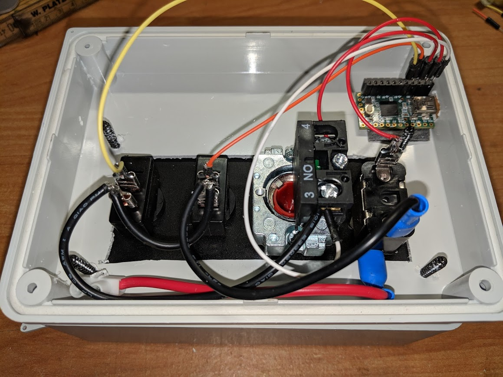
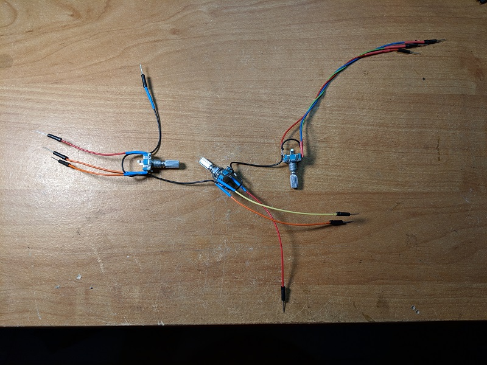
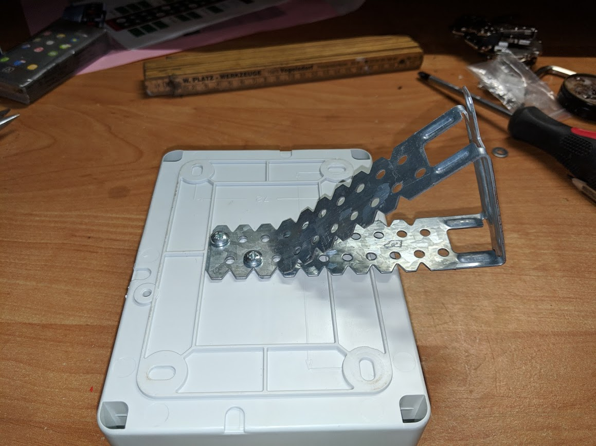
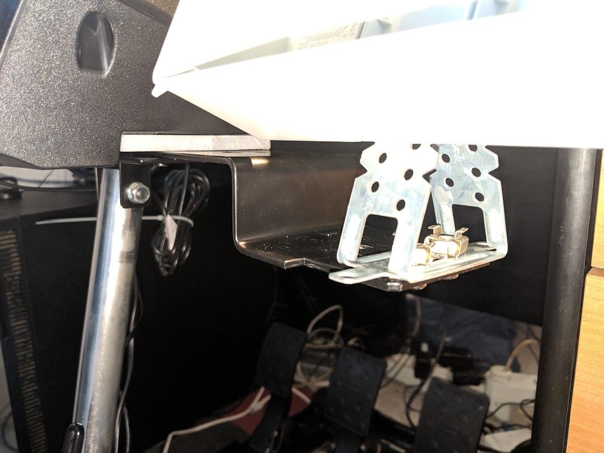

# Making the Box

This is not an bulletproof step-by-step tutorial how to build this genuine piece of simracing hardware ;-)

You should have a basic knowledge of electronics and the Arduino microcontrollers or be willing to dig into it. 
You should be able to solder or have someone at hand to help you with that part.

What you will get is a list of the parts I used, the basic building steps and some practical hints from my experience.

## Parts

<table>
    <tr>
        <th>Part</th><th>Link</th><th>Price</th>
    </tr>
    <tr>
		<td>Starter Panel</td>
 		<td>https://de.aliexpress.com/item/12V-20A-Carbon-Faser-Sim-Racing-Auto-Z-ndung-Schalter-Ersatz-Panel-Push-Start-anzeige-licht/32913185496.html</td>
		<td>15 &euro;</td>
    </tr>
    <tr>
        <td>Teensy 2.0</td>
        <td>https://de.aliexpress.com/item/Winzig-2-0-Winzig-USB-Entwicklung-Bord/32857413855.html</td>
        <td>7 &euro;</td>
    </tr>
    <tr>
        <td>Plastic box 150x115x75 mm</td>
        <td>Where you can find it</td>
        <td>&lt; 10 &euro;</td>
    </tr>
    <tr><td colspan="3"><strong>Optional it you want the light in the safety switch</strong></td></tr>
    <tr>
        <td>12DC power supply</td>
        <td>https://de.aliexpress.com/item/Hohe-Qualit-t-Hat-Netzteil-DC-12-V-1A-2A-3A-5A-6A-7A-8A-10A/32990654263.html</td>
        <td>2 &euro;</td>
    </tr>
    <tr>
        <td>12 DC Relay</td>
		<td>https://de.aliexpress.com/item/Freies-Verschiffen-10-teile-los-HK4100f-DC12V-SHG-Relais-hk4100F-DC12V-HK4100F-12-V-DIP6-3A/32861475552.html</td>
        <td>3 &euro;</td>
    </tr>
    <tr>
    	<td colspan="3"><strong>Encoder option</strong></td>
    </tr>
    <tr>
    	<td>Rotary encoders</td>
		<td>https://www.aliexpress.com/item/5PCS-Plum-handle-20mm-rotary-encoder-coding-switch-EC11-digital-potentiometer-with-switch-5-Pin/32872023811.html?spm=a2g0s.9042311.0.0.2f9f4c4d1MRzG0</td>
		<td>2 &euro;</td>
    </tr>
    <tr>
    	<td>Encoder caps, 3 colors</td>
		<td>https://www.aliexpress.com/store/product/10PCS-lot-Blue-Volume-Control-Rotary-Knobs-For-6mm-Dia-Knurled-Shaft-Potentiometer-Durable/1943479_32923555121.html?spm=2114.12010612.8148356.23.614365aeMxW6G2</td>
    	<td>3 &euro;</td>
    </tr>
    <tr>
    	<td>3mm LED</td>
    	<td>https://www.aliexpress.com/item/5Colors-20PCS-100PCS-1Color-100pcs-F3-3mm-LED-Diode-Light-Assorted-Kit-Green-Blue-White-Yellow/32886530132.html?spm=a2g0s.9042311.0.0.2f9f4c4dl8VwdI</td>
    	<td>1 &euro;</td>
    </tr>
</table>

Some additional material like wires, pin headers and adhesive pads. All together should you cost not more than 45 €.
The box should be at least 50mm in depth.

## Software requirements

You will need a programming environment for the Teensy microcontroller. I recommend [Teensyduino](https://www.pjrc.com/teensy/teensyduino.html).
Simply follow the [Download+Install](https://www.pjrc.com/teensy/td_download.html) guide on prjc.com

The provided Arduino sketches are usable for iRacing. 

There are two variants: One using keyboard mappings and another emulating joystick buttons. 

Each variant can be configured by changing the KEY\_??? oder JOY\_BTN\_??? defines in the config.h file. Changes in pin assignments may also
be made in config.h.

So you should be able to easily adopt it to any other racing simulation and/or racing equipment.

## Building

* Pre-wire the starter panel/relay accoring to the wiring diagram.
* Encoder option: Prepare encoder wiring according to the wiring diagram.
* Make the neccessary cutout in the box and mount the panel using the screws delivered with it. Tip: Fix the ACC switches with some hot glue - the plastic gland is really weak and easliy overturned.
* Make a cutout for the mini USB plug and the optional power supply wire.
* Encoder option: Drill 7mm holes for encoders and LED.
* Solder wires or pin headers on the Teensy.
* Mount the Teensy and optonal relay using adhesive pads.
* Encoder option: Mount encoders and LED in the drilled holes. Fix LED with some hot glue.
* Attach the prepared wirings to the Teensy.
* Load the provided Teensyduino sketch into the Teensy.
* Connect the Teensy and optional power supply.
* Test and Happy Racing.

### Wiring diagram

### Wiring WITHOUT optional relay

### Prewired encoders

## Mounting

I used a bent drywall connector as box mount. But any metal ankle will do the same. I used the shifter mount of my drive stand as mount base.

