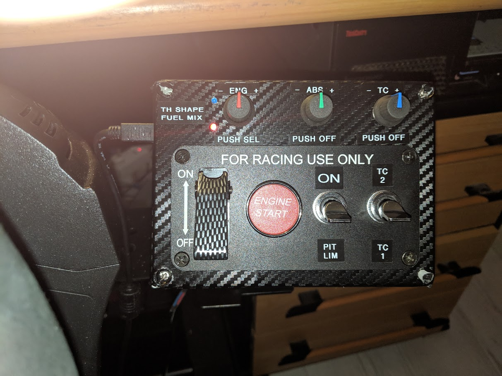

# Buttonbox for engine start and control

## Motivation

The idea came to me when I saw [this Panel on Amazon](https://www.amazon.de/dp/B01BV9CWW2/?coliid=ILLJIW41VWR2C&colid=2JV752ZE9GTFC&psc=0&ref_=lv_ov_lig_dp_it).

Then I saw similar panel on [aliexpress.com](https://de.aliexpress.com/item/12V-20A-Carbon-Faser-Sim-Racing-Auto-Z-ndung-Schalter-Ersatz-Panel-Push-Start-anzeige-licht/32913185496.html) and ordered it and started to [build](https://github.com/robbyb67/simracing/tree/master/starterbox/Making.md)

## Functions

### Ignition safety switch

The ignition switch is mapped to a single "i" character every time it's operated. 

So be sure that your simulation is consistent with it's current state. If I forget to switch it off before a new 
simulation starts, then turning off ignition on the box turns ignition on in the simulation ... you know what I mean ?! ;-)

### Engine starter

The engine starter button behaves like the "s" key on the keyboard. If you hold it down it repeats the key as a 
keyboard would do.

### Pit limiter switch

The pit limiter switch is mapped to a single "p" character every time it's operated.

### Traction control switch

The TC switch changes the characters generated by the TC encoder. This is especially made for the Ferrari 488 GTE in
iRacing which has modeled two different traction control settings.

### Traction control encoder

The encoder produces a series of "1" characters when turned left (-) and "2" characters when turned right (+) if the 
TC switch is in TC1 position. With TC switch in TC2 position the encoder produces the characters "3" when turned 
left (-) and "4" when turned right.

A push on the encoder knob produces the character "q" as a keyboard would do.

### ABS encoder

The encoder produces a series of "5" characters when turned left (-) and "6" characters when turned right (+). 
A push on the encoder knob produces the character "a" as a keyboard would do.

### Engine mode encoder

The encoder supports two settings which can be toggled by a push on the encoder knob. The two LED's on its left
indicate the selected setting (fuel mix or throttle shaping).

With fuel mix selected the encoder produces a series of "7" characters when turned left (-) and "8" characters when 
turned right (+). If throttle shaping is selected the encoder produces a series of "9" characters when turned left (-) 
and "0" characters when turned right (+).

## Configuration

### LED brightness an encoder sensitivity

LED brightness and encoder sensitivity are configurable. To enter config mode press ENG and ABS encoder while Ignition 
switch is off. Both LED light up to indicate config mode. 

You can now set LED brightness with the ENG encoder and the encoder sensitivity with the ABS encoder. While in 
config mode a push on ENG encoder will print the current LED brightness value, a push on ABS encoder prints the 
current encoder sensitivity value. 

To leave config mode switch ignition on.

The configuration is written into non volatile memory so it will remain intact when the box has no power.

### Key mappings

If you need to change any of the characters generated, you have to modify the 
[config.h](https://github.com/robbyb67/simracing/tree/master/starterbox/iracing-key/config.h) file and reprogram the
Teensy controller. As the used Teensy 2.0 does not support an external "Program" button you may have to open the box
if the loader application is not able to put the Teensy into bootloader mode.

By that means you should be able to easily adapt the functions to any other racing simulation.

