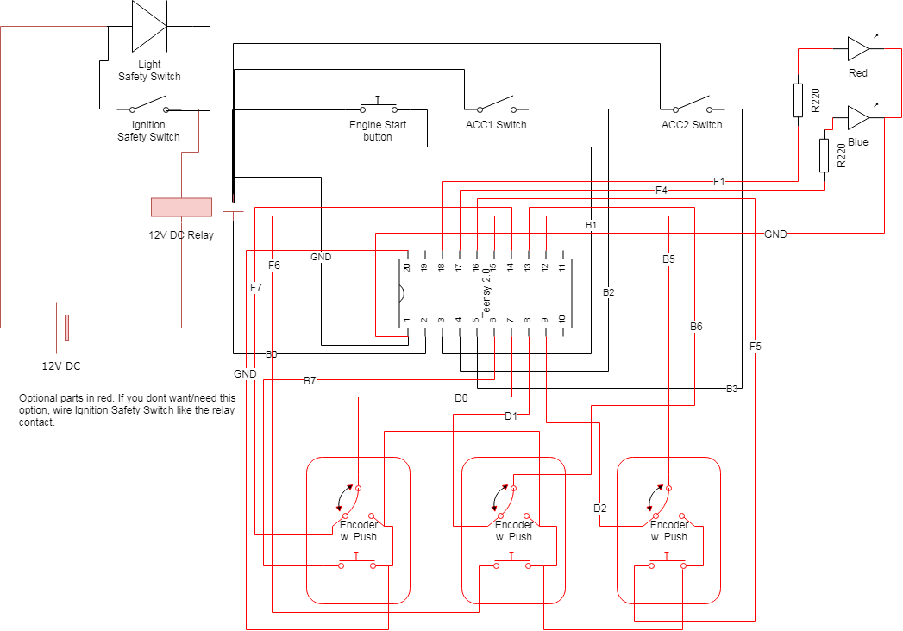

# Buttonbox for engine start and control

## Motivation

The idea came to me when I saw [this Panel on Amazon](https://www.amazon.de/dp/B01BV9CWW2/?coliid=ILLJIW41VWR2C&colid=2JV752ZE9GTFC&psc=0&ref_=lv_ov_lig_dp_it).

Then I saw similar panel on [aliexpress.com](https://de.aliexpress.com/item/12V-20A-Carbon-Faser-Sim-Racing-Auto-Z-ndung-Schalter-Ersatz-Panel-Push-Start-anzeige-licht/32913185496.html) and ordered it.

## Parts

<table>
    <tr>
        <th>Part</th><th>Link</th><th>Price</th>
    </tr>
    <tr>
        <td>Starter Panel</td><td>https://de.aliexpress.com/item/12V-20A-Carbon-Faser-Sim-Racing-Auto-Z-ndung-Schalter-Ersatz-Panel-Push-Start-anzeige-licht/32913185496.html</td><td>15 €</td>
    </tr>
    <tr>
        <td>Teensy 2.0</td><td>https://de.aliexpress.com/item/Winzig-2-0-Winzig-USB-Entwicklung-Bord/32857413855.html</td><td>7 €</td>
    </tr>
    <tr>
        <td>Plastic box 150x115x75 mm</td><td>Where you can find it</td><td>&lt; 10€</td>
    </tr>
    <tr><td colspan="3">Optional it you want the light in the safety switch</td></tr>
    <tr>
        <td>12DC power supply</td><td>https://de.aliexpress.com/item/Hohe-Qualit-t-Hat-Netzteil-DC-12-V-1A-2A-3A-5A-6A-7A-8A-10A/32990654263.html</td><td>2 €</td>
    </tr>
    <tr>
        <td>12 DC Relay</td><td>https://de.aliexpress.com/item/Freies-Verschiffen-10-teile-los-HK4100f-DC12V-SHG-Relais-hk4100F-DC12V-HK4100F-12-V-DIP6-3A/32861475552.html</td><td>3 €</td>
    </tr>
</table>

Some additional material like wires, pin headers and adhesive pads. All together should you cost not more than 40 €.
The box should be at least 50mm in depth.

## Building

* Pre-wire the starter panel/relay accoring to the wiring diagram.
* Make the neccessary cutout in the box and mount the panel using the screws delivered with it.
* Make a cutout for the mini USB plug and the optional power supply wire.
* Solder wires or pin headers on the Teensy.
* Mount the Teensy and optonal relay using adhesive pads.
* Load the provided Teensyduino sketch into the Teensy.
* Connect the Teensy and optional power supply.
* Test and Happy Racing.

## Wiring diagram

