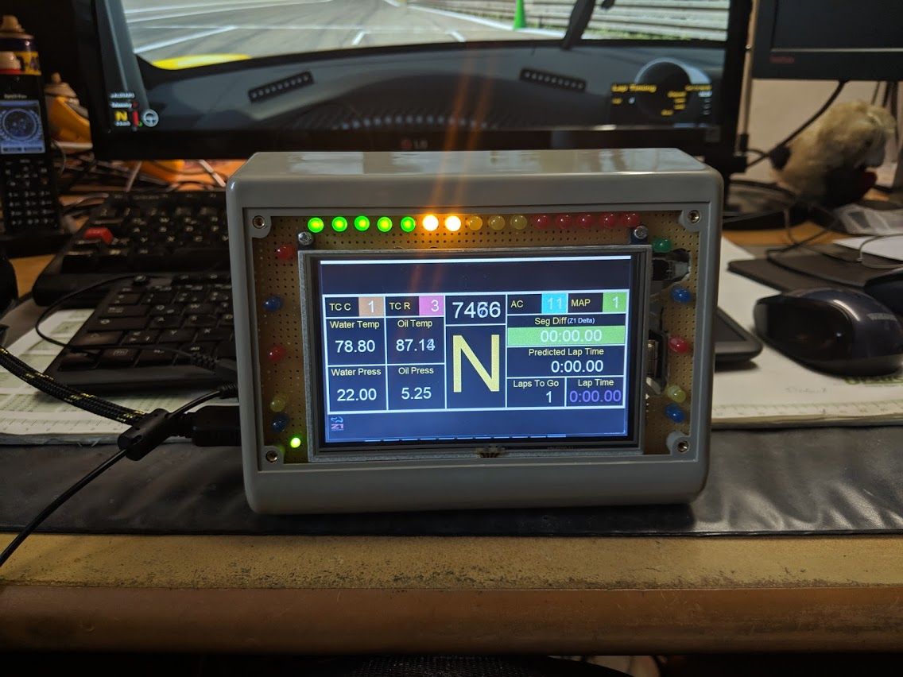
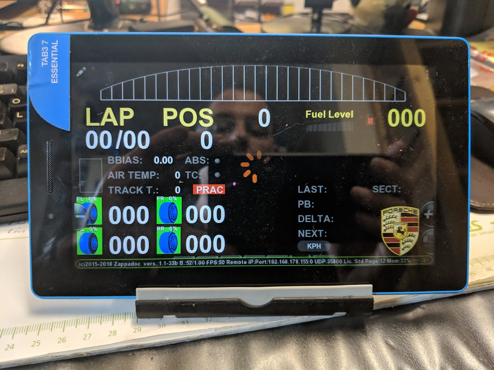
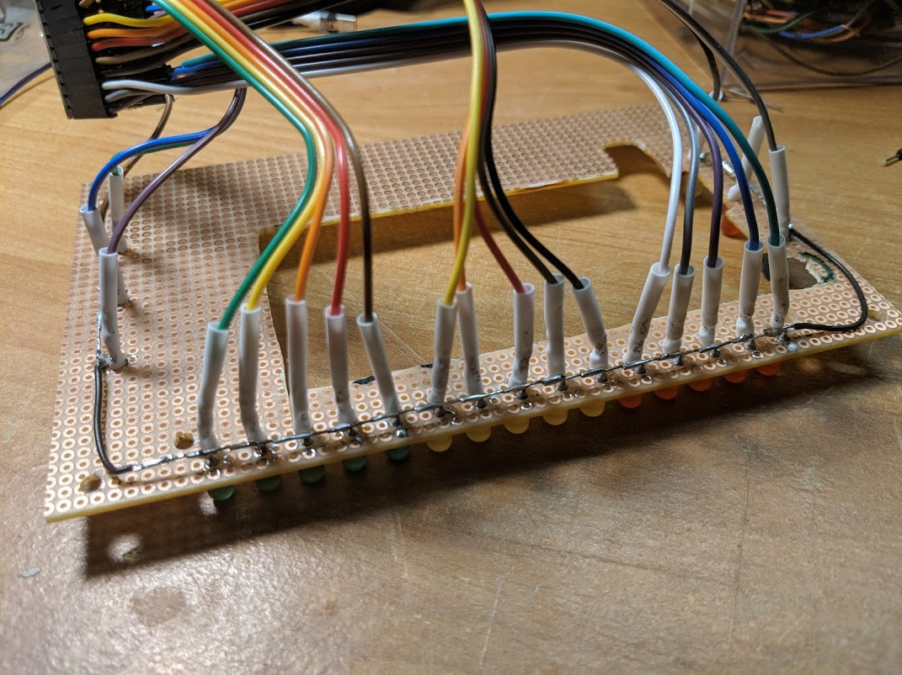
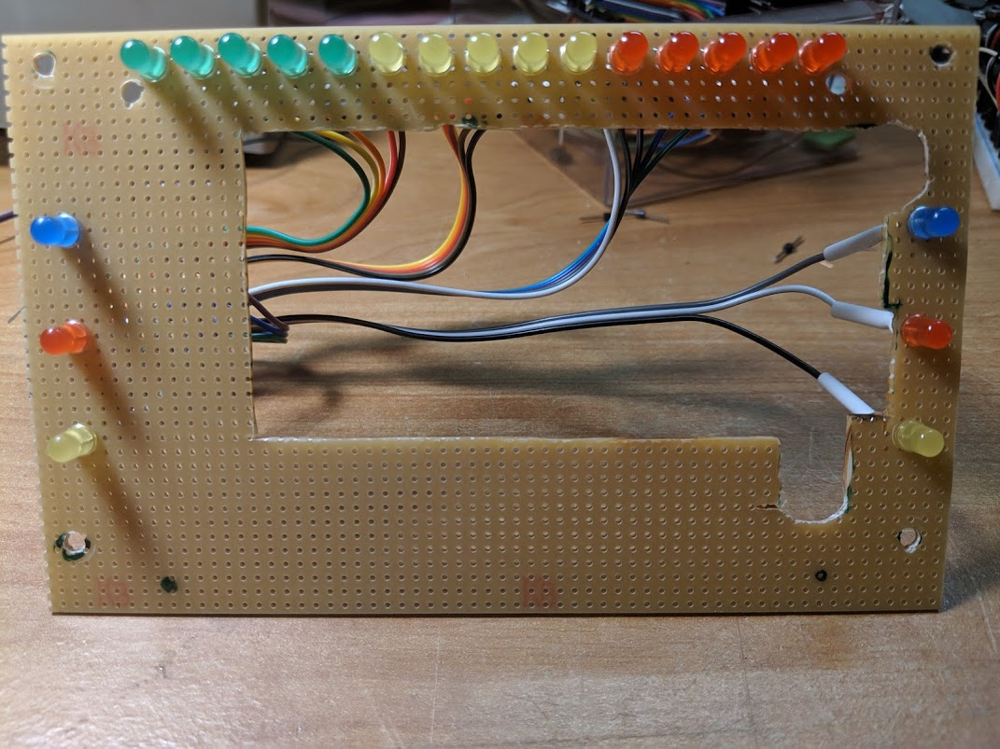
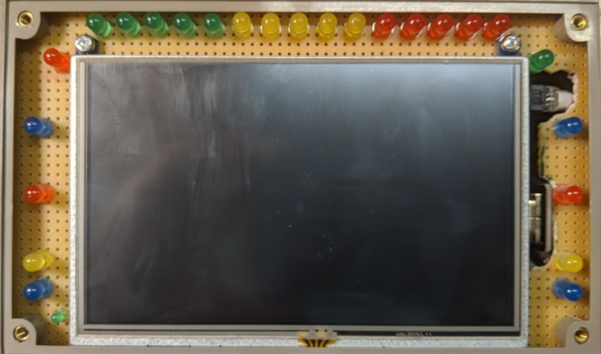

# Race display with shiftlights

There is some software which you can use to get your in car display on a second screen or tablet.

## SLIMax Manager Pro

First I tried [SLIMax Manager Pro](http://www.eksimracing.com/slimax-manager-overview/) which is free
for personal use and supports a lot of simracing hardware (displays like SLI-Pro, SLI-M etc., 
Thrustmaster, Fanatec and Logitech wheels and more). It also brings the VDASH-EMU - a configurable
in car race display which can run on Windows, Android and Linux systems. Each instance of VDASH-EMU
requires a 5$ donation to get it licensed.

The problem with VDASH-EMU is - although you can desing your own dashboards - that the available
dashboards are not really like the displays in cars as shown in the various simulations.

In addition - the button-boxes provided by the VDASH are difficult to operate while in a race. The
needed tactile feedback is missing.

A great feature of this software is a free firmware for the Teensy LC microcontroller which supports
shiftlights, the marshall lights and up to 5 additional lights as real LED's.

## Z1 Dashboard

Another great software for in car displays is the [Z1 Dashboard](http://www.z1simwheel.com/dashboard/index.cfm)
which is available for 25$. This software is available only on Windows systems.

The big advantage against the VDASH-EMU are the realism of the dashboards which cover almost any car
available in iRacing. 

In addition they offer the Z1 LCD Screen for 224$ - thats a lot.

## The DIY solution

Small [LCD displays with HDMI input](https://www.amazon.de/Waveshare-Resistive-Resolution-Interface-Raspberry/dp/B07JLZWV1Q)
are available for 40€. Designed for Raspberry Pi they can be operated as an additional display on 
Windows systems.g display:

The complete list of parts needed is:

<table border="1">
	<tr><th>Part</th><th>Price</th></tr>
	<tr>
		<td><a href="https://www.amazon.de/Waveshare-Resistive-Resolution-Interface-Raspberry/dp/B07JLZWV1Q">Display</a></td>
		<td>40 &euro;</td>
	</tr>
	<tr>
		<td><a href="https://www.amazon.de/gp/product/B00W1MSRUU/">Housing</a></td>
		<td>19 &euro;</td>
	</tr>
	<tr>
		<td><a href="https://www.ebay.de/itm/InLine-HDMI-Adapter-zum-Einbau-mit-Gewinde-HDMI-A-Buchse-Buchse-4K2K-17600O/273704831014">HDMI Socket</a></td>
		<td>5 &euro;</td>
	</tr>
	<tr>
		<td><a href="https://www.ebay.de/itm/Lochrasterplatine-H25PR-Lötpunkte-Leiterplatte-Labor-Experiment-160-x-100-mm/223376797349">PCB as mounting base for LED's and display</a></td>
		<td>3 &euro;</td>
	</tr>
	<tr>
		<td><a href="https://www.ebay.de/itm/HDMI-Typ-A-Stecker-rechts-gewinkelt-für-DIY-HDMI-Kabel-Adapter-FPC-Ribbon/123739419987">2x HDMI DYI plug</a></td>
		<td>10 &euro;</td>
	</tr>
	<tr>
		<td><a href="https://www.ebay.de/itm/Flachbandkabel-20cm-für-DIY-HDMI-Kabel-FPC-Ribbon-Flachkabel/123739419465">HDMI DYI ribbon cable</a></td>
		<td>2 &euro;</td>
	</tr>
	<tr>
		<td><a href="https://www.amazon.de/gp/product/B01BMRTZGE">Teensy LC</a></td>
		<td>23 &euro;</td>
	</tr>
	<tr>
		<td><a href="https://de.aliexpress.com/item/5Colors-20-PCS-100-PCS-5mm-LED-Diode-Licht-Assorted-Kit-Gr-n-Blau-Wei-Gelb/32851364472.html">LED different colors</a></td>
		<td>1 &euro;</td>
	</tr>
	<tr>
		<td><a href="https://de.aliexpress.com/item/100PCS-LOT-1-4W-metal-film-resistor-330-ohm-0-25W-resistor-1-4W-resistor-color/32702703470.html">R220 resistors</a></td>
		<td>1 &euro;</td>
	</tr>
	<tr>
		<td>Total</td><td>104 &euro;</td>
	</tr>
</table>

The wiring of the LED's is according to the description in the [v2r LED controller documentation](v2r_led_controller_doc.pdf).

The LCD display is mounted on the wired PCB:

